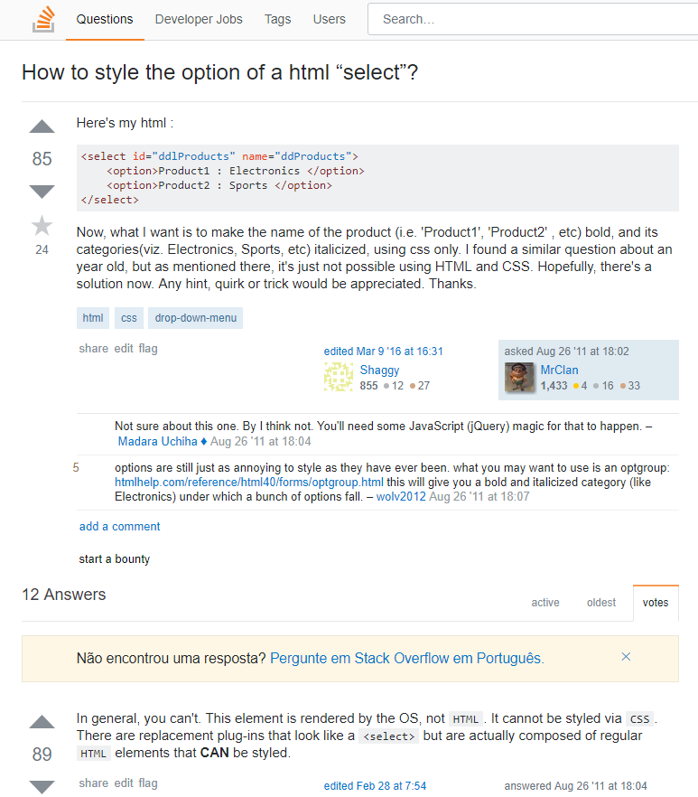

## Create your own full customized select element

Hi everyone, this is my first post in English, so if you find any mess about my English feel free to help me! :)

### The problem
When we are doing html forms, always, I mean 90% of the time, we have a select element and I a need to customize his style, so a good approach that I use is use radio buttons with labels.

As you can see here: [https://stackoverflow.com/questions/7208786/how-to-style-the-option-of-a-html-select](https://stackoverflow.com/questions/7208786/how-to-style-the-option-of-a-html-select), customizing the option element its a boring thing to do, in the most of cases we use a plugin for it.



### My Solution
We create *divs* and *labels* that are fully visually customized, all labels have a *for* attributte that references to hidden *radio* buttons, so we can get the value of the *radio* and simulate the select/option element.

```html
<label for="chkMenu" class="menu__button"></label>
<input type="checkbox" id="chkMenu">
<label for="chkMenu" class="menu__helper"></label>
<nav class="nav__menu">
  <ul>
    <li>Home</li>
    <li>About Us</li>
    <li>Contact</li>
    <li>Support Me</li>
  </ul>
</nav>
```

```css
*{
  box-sizing:border-box;
}
main{
  width:600px;
  display:flex;
  margin:0 auto;
}
.wrapper-select{
  position:relative;
  width:100%;
}
.wrapper-select input{
  display:none;
}
.select__atual{
  height:50px;
  width:100%;
  cursor:pointer;
  border:1px solid;
  border-color: #cecece;
  display:flex;
  align-items:center;
  padding:0 15px;
}
.select__atual.open{
  border-bottom:none;
}
.select__opcoes{
  width:100%;
  display:none;
  border:1px solid;
  border-top:none;
  border-color:#cecece;
}
.select__opcoes__label{
  display:flex;
  height:50px;
  width:100%;
  align-items:center;
  padding:0 15px;
  cursor:pointer;
}
```

Combining it with a little of *js* (jquery in this case, but you can do it only with vanilla js) for the open/select function:

```javascript
var selectBox = $('.select__atual');
var selectOption = $('.select__opcoes__label');

selectBox.click(function(){
  $(this).toggleClass('open');
  $('.select__opcoes').toggle();
});

selectOption.click(function(){
  var selectName = $(this).text();
  $('.select__atual__text').text(selectName);
});
```

Now your "select element" is ready and you can use the radio value in your form.

This is a very basic example showing how to create a custom select element, you can add hover or any effects that you need and the full example of this post can be found [here](https://codepen.io/haykou/pen/yvREdJ)

I have made an *Jquery* plugin using the base of code explained in this post, if you can test it, feel free to contribute and open issues on it!

Github of the project: [https://github.com/heliomsolivas/heliosCustomSelect](https://github.com/heliomsolivas/heliosCustomSelect)