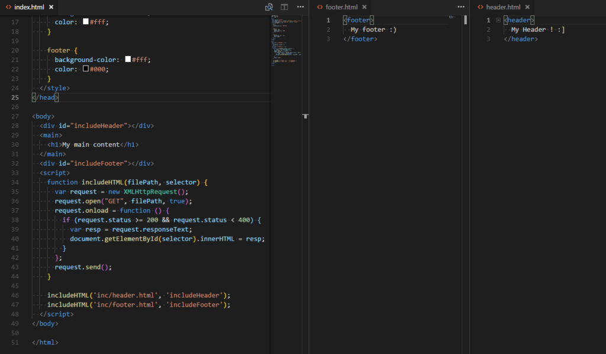

Hi everyone :)

As everyone can see, I have bought a domain and moved my blog to Wordpress (Hubpress was pissing me off), so today I'm gonna show one way to include external HTML files to another HTML, something like the php include but using only javascript.

I know that's not the best practice but if you want to use only the client side this could be a good alternative to the includes.

First, I will create a simple index.html, with some styles:
```html
<body>
  <main>
    <div id="includeHeader"></div>
    <h1>My main content</h1>
    <div id="includeFooter"></div>
  </main>
</body>
```

```css
main {
  background-color: #EC644B;
}

header {
  height: 70px;
  background-color: #000;
  color: #fff;
}

footer {
  background-color: #fff;
  color: #000;
}
```

Now I will create a function that will make the request of the externals HTMLs:
```javascript
function includeHTML(filePath, selector) {
  //Make the request
  var request = newXMLHttpRequest();
 //Get the filePath
  request.open("GET", filePath, true);
  request.onload = function () {
    if (request.status >= 200 && request.status < 400) {
      //Take the response and append to a selector
      var resp = request.responseText;
      document.getElementById(selector).innerHTML = resp;
      }
   };
request.send();
}
```

And we call the function passing the parameters:
```javascript
includeHTML('inc/header.html', 'includeHeader');
includeHTML('inc/footer.html', 'includeFooter');
```



As you can see the files now are added to the <strong>index.html.</strong>

For better results we can add a loader, so we can hide the "blink" of the get request. (The example in the top of the post).

I hope that can be usefull for someone, I personally have used sometimes this stuff, if you have any question about it, feel free to comment below. Thanks! :)