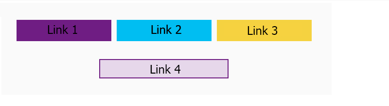

Last days I was on project that I had to create links inside an image (something like a image map), so first I thought that I could create a wrapper for the image and some links with position absolute. Ok? At first look it's ok but when I resized the image was fluid (max-width:100% + height:auto) and then I had to write more CSS to prevent all the resolutions. Problem, right?

So I remember that I used the HTML map tag to do something like this (image map) in a long time ago.

Here is a example:

This is the image that we need to map:

Then I use this website: <a href="https://www.image-map.net/">https://www.image-map.net/</a> that generates the code of the mapping to you. You do not need to calculate the coords manually. Will be something like this:

So the result will be this:

As you can see on full resolution the mapping was ok, but when I resized it the links disappeared. Back to zero? No, we can use a plugin the automatically calculates the new coordinates based on image size (or you could do it by yourself :P).

In this case I used [https://github.com/clarketm/image-map](https://github.com/clarketm/image-map) but you could use any that fits better for you case. So, this is the way to create an image map and maybe someday you have to do one. :)

If you need the full code is here: [https://codepen.io/haykou/pen/VBXQqB](https://codepen.io/haykou/pen/VBXQqB) and any questions feel free to leave a comment!

Final result:

