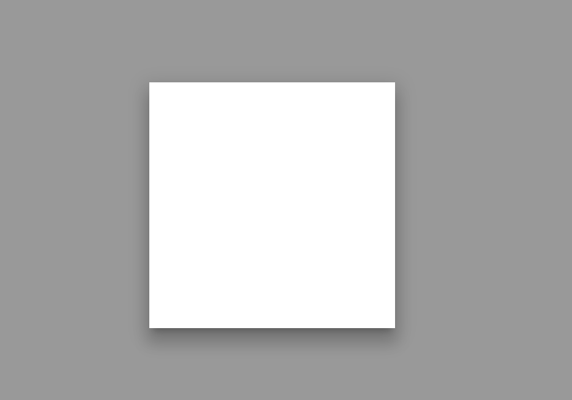
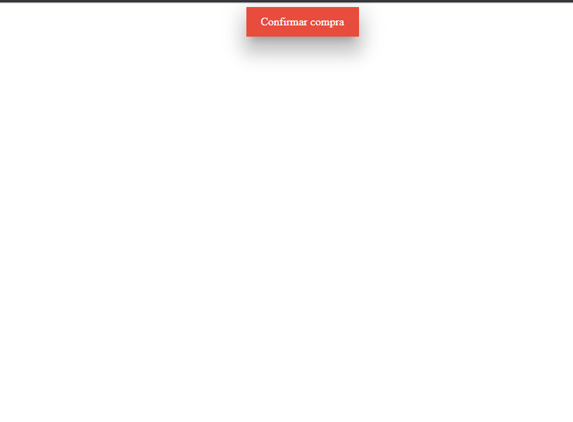

Fala pessoal beleza? Semana passada durante uma integração, um dev me perguntou onde estava o script que gerava o modal de uma tela. Ele meio que se assustou quando eu disse que não tinha script nenhum, era só html/css. Então resolvi mostrar como eu monto um modal simples, apesar de um assunto antigo e batido, acredito que muita gente não sabe fazer um modalzinho simples na "mão".

O conceito é simples, aquele que utiliza um checkbox com seus estados checked e unchecked para manipular os outros elementos.

Vamos começar criando um modal:

```css
.meu__modal__bg{
  background:rgba(0,0,0,0.4);
  position:fixed;
  z-index:1;
  top:0;
  left:0;
  height:100%;
  width:100%;
  transition: all .6s ease;
  cursor:pointer;
}
.meu__modal{
  height:400px;
  width:400px;
  position:fixed;
  left:50%;
  transform:translate(-50%, -50%);
  z-index:2;
  background:#fff;
  top:50%;
  box-shadow: 0 24px 38px 3px rgba(0,0,0,.14), 0 9px 46px 8px rgba(0,0,0,.12), 0 11px 15px -7px rgba(0,0,0,.2);
}
```



Lembrando que o .meu__modal__bg deve ser um label que se refere ao nosso checkbox.

Depois vamos deixar a opacidade do background do modal e do próprio modal para 0 e criar um botão que também deve ser um label para mostrar o modal e fazer a "jogada" do checkbox checked + seletor irmão (~) pelo CSS:

```css
.meu__modal__bg{
  background:rgba(0,0,0,0.4);
  position:fixed;
  z-index:1;
  top:0;
  left:0;
  height:100%;
  width:100%;
  transition: all .6s ease;
  cursor:pointer;
  opacity:0;
}
.meu__modal{
  height:400px;
  width:400px;
  position:fixed;
  left:50%;
  transform:translate(-50%, -50%);
  z-index:2;
  background:#fff;
   transition: all .6s ease;
  opacity:0;
  top:50%;
  box-shadow: 0 24px 38px 3px rgba(0,0,0,.14), 0 9px 46px 8px rgba(0,0,0,.12), 0 11px 15px -7px rgba(0,0,0,.2);
  display:flex;
  align-items:center;
  justify-content:center;
}
.meu__modal p{
  font-size:24px;
}
.btn__confirm{
  height:42px;
  width:160px;
  background:#e74c3c;
  color:#fff;
  display:flex;
  margin:auto;
  align-items:center;
  justify-content:center;
  box-shadow: 0 24px 38px 3px rgba(0,0,0,.14), 0 9px 46px 8px rgba(0,0,0,.12), 0 11px 15px -7px rgba(0,0,0,.2);
}
.mychk{
  display:none;
}
.mychk:checked ~ .meu__modal{
  opacity:1;
}
.mychk:checked ~ .meu__modal__bg{
  opacity:1;
}
```

(Dei uma leve incrementada no css, só pra deixar mais bonito)

E o HTML:
```html
<label for="myChk" class="btn__confirm">Confirmar compra</label>
<input type="checkbox" id="myChk" class="mychk">
<label class="meu__modal__bg" for="myChk"></label>
<div class="meu__modal">
    <p>Compra realizada com sucesso!</p>
</div>
```

Sucesso, o sorvetinho ta pronto :)



Se você precisar adicionar um "X" de fechar no canto do modal, é só criá-lo como label e referenciar o checkbox novamente. Caso precisem do código completo ele está no meu codepen: [https://codepen.io/haykou/pen/YRjxEP](https://codepen.io/haykou/pen/YRjxEP)

Estou aceitando sugestões post de coisas complicadas de se fazer no front-end! valeu :)